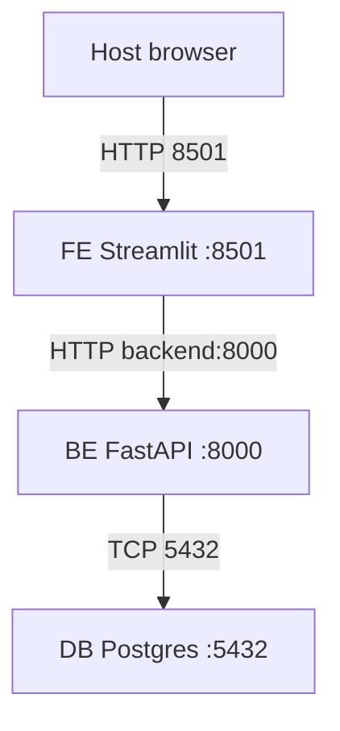
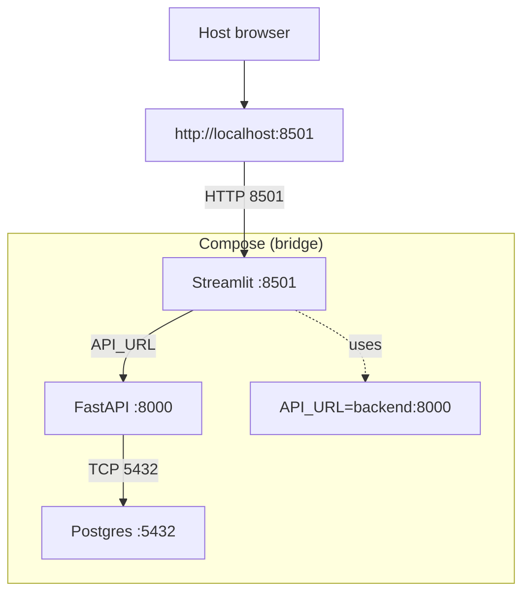

# EXAMEN DE MI-SESSION 


## CONSIGNES GÉNÉRALES

* Écrivez lisiblement et respectez la numérotation.


<br/>

# PARTIE 1 — QCM Docker (30%)


**Q1. Docker est :**
- [ ] A. Un système d'exploitation
- [ ] B. Un outil de conteneurisation
- [ ] C. Un éditeur de texte
- [ ] D. Un langage de programmation

**Q2. Fichier pour définir la config d'une image Docker :**
- [ ] A. Docker.yml
- [ ] B. Docker-compose.yml
- [ ] C. Dockerfile
- [ ] D. Config.json

**Q3. Télécharger une image depuis Docker Hub :**
- [ ] A. `docker download`
- [ ] B. `docker pull`
- [ ] C. `docker get`
- [ ] D. `docker fetch`

**Q4. Lancer un conteneur :**
- [ ] A. `docker start`
- [ ] B. `docker execute`
- [ ] C. `docker run`
- [ ] D. `docker create`

**Q5. Lister les conteneurs en cours :**
- [ ] A. `docker list`
- [ ] B. `docker ps`
- [ ] C. `docker show`
- [ ] D. `docker display`

**Q6. Effet de `docker stop <container>` :**
- [ ] A. Arrête un conteneur
- [ ] B. Supprime un conteneur
- [ ] C. Démarre un conteneur
- [ ] D. Redémarre un conteneur

**Q7. Fichier multi-services :**
- [ ] A. `Dockerfile`
- [ ] B. `docker-compose.yml`
- [ ] C. `docker-config.yml`
- [ ] D. `multi-docker.yml`

**Q8. Créer une image à partir d’un Dockerfile :**
- [ ] A. `docker create`
- [ ] B. `docker build`
- [ ] C. `docker init`
- [ ] D. `docker compile`

**Q9. Supprimer un conteneur :**
- [ ] A. `docker delete`
- [ ] B. `docker remove`
- [ ] C. `docker rm`
- [ ] D. `docker stop`

**Q10. Utilité principale de Docker :**
- [ ] A. Virtualiser des machines
- [ ] B. Gérer des bases de données
- [ ] C. Isoler et déployer des applications
- [ ] D. Créer des pages web


<br/>
<br/>


# PARTIE 2 — Linux : **Écrire la commande** (20%)

> Consigne : écrivez **exactement** la commande demandée (une seule ligne, options minimales).
> Exemple : pour lister les fichiers, répondez `ls`.

1. **Lister** les fichiers du dossier courant.
   `[réponse]`

2. Afficher le **chemin complet** du dossier courant.
   `[réponse]`

3. Lister **aussi les fichiers cachés** (ceux qui commencent par `.`).
   `[réponse]`

4. Aller dans le dossier **Documents** (situé dans votre home).
   `[réponse]`

5. Revenir au **dossier précédent**.
   `[réponse]`

6. Créer un **dossier** nommé `demo`.
   `[réponse]`

7. Créer un **fichier vide** nommé `notes.txt`.
   `[réponse]`

8. Écrire le texte `bonjour` dans `notes.txt` (en **écrasant** le contenu).
   `[réponse]`

9. Afficher le **contenu** de `notes.txt`.
   `[réponse]`

10. Copier `notes.txt` vers `demo/`.
    `[réponse]`

11. **Renommer** `notes.txt` en `notes_old.txt`.
    `[réponse]`

12. **Déplacer** `notes_old.txt` dans `demo/`.
    `[réponse]`

13. **Supprimer** le fichier `notes_old.txt` (dans `demo/`).
    `[réponse]`

14. **Supprimer un dossier** `demo` et tout son contenu (de façon récursive).
    `[réponse]`


15. Compter le **nombre de lignes** d’un fichier.
    `[réponse]`


<br/>
<br/>

# Partie 3 (30%)

> Décrire la pipeline ci-dessous et le rôle de chaque élément:


<br/>
<br/>

# PARTIE 4 — Docker Compose • Streamlit (FE) + FastAPI (BE) + PostgreSQL (DB) (20%)

**Modalité**

* Individuel.
* Environnement : **Linux** (VM ou poste).
* Réseau : **HTTP simple** (pas de reverse proxy / pas de HTTPS).

**But**
Déployer une application 3 services (**frontend/Streamlit**, **backend/FastAPI**, **db/PostgreSQL**) avec **docker-compose**, démontrer la persistance et fournir les preuves demandées.

<br/>

# 1) Tâches à réaliser (sur Linux)

1. **Cloner / créer** un projet avec l’arborescence minimale (voir §4).
2. **Compléter** le `docker-compose.yml` (Annexe A).
3. **Dockeriser** le backend FastAPI (Annexe B) et le frontend Streamlit (Annexe C).
4. **Configurer** l’accès interne :

   * FE → BE via `http://backend:8000` (nom de service).
   * BE → DB via `postgresql+psycopg2://appuser:apppass@db:5432/appdb`.
5. **Persister** la base via un volume nommé `pgdata`.
6. **Lancer**: `docker compose up -d --build`.
7. **Vérifier** le fonctionnement (voir §2 “Captures à fournir”).
8. **Rédiger** un `Rapport word` contenant :

   * Les **commandes** exécutées.
   * Les **captures** exigées.

<br/>

## 2) Captures d’écran obligatoires (prises dans la VM Linux)

* Terminal : `docker compose up -d --build` **puis** `docker compose ps` (3 services UP, DB healthy).
* Santé backend :

  * soit `curl http://localhost:8000/health` (si le port 8000 est publié),
  * soit preuve indirecte via Streamlit qui liste les notes sans erreur.
* UI Streamlit : ajout **réussi** d’une note + **affichage** de la liste contenant cette note.
* Persistance :

  * `docker compose down` (sans `-v`) puis `docker compose up -d`,
  * la note est **toujours présente** (preuve du volume `pgdata`).

> Bonus facultatif : capture `docker logs` (initialisation), ou inspection DB via `psql` en conteneur.

<br/>

## 3) Contraintes / règles

* **Noms de services** : `frontend`, `backend`, `db`.
* **Ports publiés** :

  * `frontend` : `8501:8501` (UI sur `http://localhost:8501`).
  * `backend` : publication **optionnelle** `8000:8000` (utile pour tester `/docs`/`/health`).
  * `db` : publication **optionnelle** `5432:5432`.
* **Pas** de reverse proxy / TLS.
* **Ne pas** utiliser `localhost` dans Streamlit pour joindre l’API (utiliser `backend:8000`).
* **Volume** `pgdata` obligatoire pour la persistance.

<br/>

## 4) Arborescence minimale exigée

```
/exam-stack/
  docker-compose.yml
  README.md
  backend/
    Dockerfile
    app.py
    requirements.txt
  frontend/
    Dockerfile
    app.py
    requirements.txt
```

<br/>

## 5) Livrables

* **Archive ZIP** (ou dépôt Git) contenant le projet complet.
* **Rapport word** avec :

  * les **commandes** utilisées,
  * **toutes** les **captures** exigées (§2).


<br/>

## 6) Grille

* Structure & conformité (noms, réseau, volume) — 10 %.
* Backend fonctionnel (API, DB, santé) — 15 %.
* Frontend fonctionnel (appels API) — 15 %.
* Persistance démontrée (volume) — 10 %.
* Rapport word + preuves claires — 40 %.


<br/>

# ANNEXES (code fourni)


> Note importante

Les éléments de code fournis sont **intentionnellement minimaux** et **ne garantissent pas** un fonctionnement immédiat. Cette situation est **voulue** afin d’évaluer votre **capacité à diagnostiquer, dépanner et compléter** l’architecture (réseau Compose, variables, dépendances, droits, timing de démarrage, etc.). Il vous revient d’effectuer les ajustements nécessaires et d’en **démontrer le bon fonctionnement** par les captures demandées.


## Annexe A — `docker-compose.yml` (modèle minimal)

```yaml
services:
  db:
    image: postgres:16-alpine
    environment:
      POSTGRES_DB: appdb
      POSTGRES_USER: appuser
      POSTGRES_PASSWORD: apppass
    volumes:
      - pgdata:/var/lib/postgresql/data
    healthcheck:
      test: ["CMD-SHELL", "pg_isready -U appuser -d appdb"]
      interval: 5s
      timeout: 3s
      retries: 10
    # ports:
    #   - "5432:5432"   # optionnel

  backend:
    build: ./backend
    environment:
      DATABASE_URL: postgresql+psycopg2://appuser:apppass@db:5432/appdb
    depends_on:
      db:
        condition: service_healthy
    # ports:
    #   - "8000:8000"   # optionnel

  frontend:
    build: ./frontend
    environment:
      API_URL: http://backend:8000
    depends_on:
      - backend
    ports:
      - "8501:8501"

volumes:
  pgdata:
```

<br/>

## Annexe B — Backend FastAPI

**`backend/requirements.txt`**

```
fastapi
uvicorn[standard]
SQLAlchemy>=2.0
psycopg2-binary
pydantic
```

**`backend/app.py`**

```python
import os
from typing import List
from fastapi import FastAPI
from pydantic import BaseModel
from sqlalchemy import create_engine, text

DATABASE_URL = os.getenv(
    "DATABASE_URL",
    "postgresql+psycopg2://appuser:apppass@db:5432/appdb"
)

engine = create_engine(DATABASE_URL, pool_pre_ping=True)
app = FastAPI(title="API Notes")

# Init table
with engine.begin() as conn:
    conn.execute(text("""
        CREATE TABLE IF NOT EXISTS notes (
            id SERIAL PRIMARY KEY,
            content TEXT NOT NULL
        )
    """))

class NoteIn(BaseModel):
    content: str

class NoteOut(BaseModel):
    id: int
    content: str

@app.get("/health")
def health():
    with engine.connect() as conn:
        conn.execute(text("SELECT 1"))
    return {"status": "ok"}

@app.get("/notes", response_model=List[NoteOut])
def list_notes():
    with engine.connect() as conn:
        rows = conn.execute(
            text("SELECT id, content FROM notes ORDER BY id DESC")
        ).mappings().all()
    return [{"id": r["id"], "content": r["content"]} for r in rows]

@app.post("/notes", response_model=NoteOut)
def add_note(note: NoteIn):
    with engine.begin() as conn:
        row = conn.execute(
            text("INSERT INTO notes(content) VALUES (:c) RETURNING id, content"),
            {"c": note.content}
        ).mappings().first()
    return {"id": row["id"], "content": row["content"]}
```

**`backend/Dockerfile`**

```dockerfile
FROM python:3.11-slim
WORKDIR /app
COPY requirements.txt .
RUN pip install --no-cache-dir -r requirements.txt
COPY . .
EXPOSE 8000
CMD ["uvicorn", "app:app", "--host", "0.0.0.0", "--port", "8000"]
```

<br/>

## Annexe C — Frontend Streamlit

**`frontend/requirements.txt`**

```
streamlit
requests
```

**`frontend/app.py`**

```python
import os, requests, streamlit as st

API_URL = os.environ.get("API_URL", "http://backend:8000")

st.title("Streamlit + FastAPI + PostgreSQL")

with st.form("add"):
    content = st.text_input("Nouvelle note")
    submitted = st.form_submit_button("Ajouter")
    if submitted and content.strip():
        r = requests.post(f"{API_URL}/notes", json={"content": content})
        if r.ok:
            st.success("Note ajoutée.")
        else:
            st.error(f"Erreur API: {r.text}")

st.subheader("Notes")
try:
    r = requests.get(f"{API_URL}/notes", timeout=5)
    if r.ok:
        for n in r.json():
            st.write(f"• #{n['id']} — {n['content']}")
    else:
        st.error("Impossible de récupérer les notes (API).")
except Exception as e:
    st.error(f"Connexion API échouée: {e}")
```

**`frontend/Dockerfile`**

```dockerfile
FROM python:3.11-slim
WORKDIR /app
COPY requirements.txt .
RUN pip install --no-cache-dir -r requirements.txt
COPY . .
EXPOSE 8501
CMD ["streamlit", "run", "app.py", "--server.address=0.0.0.0", "--server.port=8501"]
```

<br/>

## Annexe D — Schémas

**Schéma 1**



**Schéma 2 (plus de détails)**



