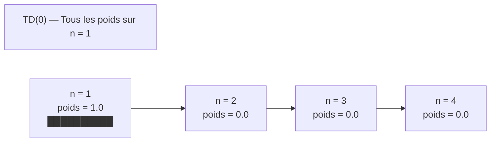
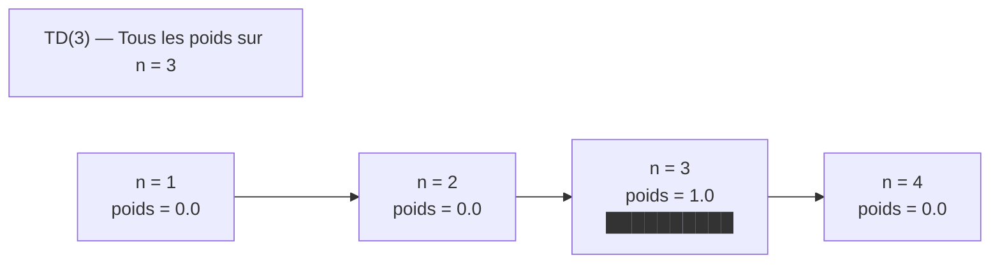
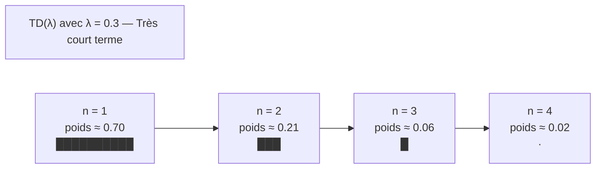
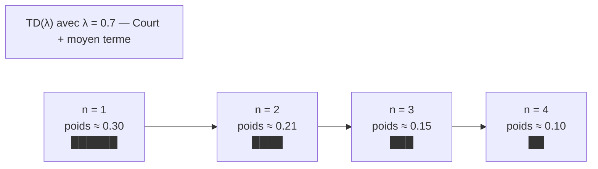

1. D’abord, j’explique ce que représentent les “poids” pour n = 1, 2, 3, 4.
2. Ensuite, je donne des **diagrammes** façon “barres” (avec des █) pour :

   * TD(0)
   * TD(n) (exemple n = 3)
   * TD(λ) avec λ = 0.3
   * TD(λ) avec λ = 0.7
3. Puis je relie ça à l’exemple **d’évaluation d’un employé**.

## 1. Ce que représentent les “poids” pour n = 1, 2, 3, 4

Pour la “vue forward” de TD(λ), tu peux voir les choses comme ça :

* TD(0) : je regarde **uniquement** ce qui se passe à 1 pas dans le futur.
* TD(n) : je regarde **uniquement** ce qui se passe dans n pas (n = 3 par exemple).
* TD(λ) : je fais une moyenne pondérée de TD(1), TD(2), TD(3), …, avec des poids qui décroissent en fonction de λ.

Ici, les **poids pour n = 1, 2, 3, 4** représentent :

> Combien j’écoute le retour à 1 pas, 2 pas, 3 pas, 4 pas dans le calcul de ma mise à jour.

Pour un TD(λ) “forward view”, les poids sont :
[
w_n = (1-\lambda)\lambda^{n-1}
]

---

## 2. Diagrammes “barres” pour TD(0), TD(3), TD(λ)

Je simule des barres avec des blocs `█` dans les labels.
Tu peux copier-coller ces blocs Mermaid tels quels.

### 2.1. TD(0) — tout le poids sur n = 1, zéro ailleurs

Ici, je mets tout le poids sur le 1er pas (n = 1), rien sur n = 2, 3, 4.

**Interprétation :**

* TD(0) : l’algorithme ne regarde que la conséquence immédiate.
* On pourrait dire, pour l’employé : tu ne juges que **la dernière semaine**, tu ignores tout le reste.

---

### 2.2. TD(n) avec n = 3 — tout le poids à 3 pas

Ici, on montre un TD(3) : tout le poids sur n = 3, zéro ailleurs.

**Interprétation :**

* TD(3) : tu attends exactement 3 pas pour juger.
* Pour l’employé : tu juges sa performance actuelle **en regardant uniquement les 3 prochaines semaines**, pas juste la prochaine, pas les autres.

---

### 2.3. TD(λ) avec λ = 0.3 — très court terme

Poids théoriques :

* w1 = 0.7
* w2 = 0.7 × 0.3 = 0.21
* w3 ≈ 0.063
* w4 ≈ 0.019

Je les normalise visuellement avec des barres :

* n = 1 : 10 blocs
* n = 2 : 3 blocs
* n = 3 : 1 bloc
* n = 4 : presque rien

**Interprétation :**

* λ petit (0.3) :
  → tu regardes surtout **le tout proche futur** (n = 1),
  → tu regardes un peu n = 2, très peu n = 3, presque rien au-delà.
* Pour l’employé : tu juges surtout sur la **dernière semaine**, un peu sur celle d’avant, très peu sur celles plus anciennes.

---

### 2.4. TD(λ) avec λ = 0.7 — horizon plus long

Poids théoriques :

* w1 = 0.3
* w2 = 0.21
* w3 ≈ 0.147
* w4 ≈ 0.103

Ils sont plus équilibrés entre eux. On peut représenter ça comme :

* n = 1 : 6 blocs
* n = 2 : 4 blocs
* n = 3 : 3 blocs
* n = 4 : 2 blocs

**Interprétation :**

* λ plus grand (0.7) :
  → tu n’es plus obsédé par n = 1 seulement,
  → tu prends aussi sérieusement en compte n = 2, n = 3, n = 4.
* Pour l’employé : tu juges :

  * beaucoup sur les dernières semaines,
  * mais tu gardes une bonne mémoire des semaines un peu plus anciennes.

---

## 3. Lire les diagrammes pour comprendre TD(0), TD(n), TD(λ)

### 3.1. TD(0) via le schéma

Dans le schéma TD(0) :

* seule la 1ère barre est pleine, les autres sont vides.
* Cela signifie : je n’utilise **qu’un horizon d’un seul pas** dans ma mise à jour.

En pratique :
“Je corrige ma valeur de l’état actuel **uniquement** avec la prochaine récompense et la prochaine valeur.”

---

### 3.2. TD(n) via le schéma

Dans le schéma TD(3) :

* seule la barre n = 3 est pleine.
* Cela signifie : je ne fais ma mise à jour que quand j’ai vu **3 pas** de plus (3 récompenses + V(S_{t+3})).

En pratique :
“Je juge un état avec ce qui se passe **exactement** dans n pas. Pas plus court, pas plus long.”

---

### 3.3. TD(λ) via les schémas

* Pour λ = 0.3 :
  barre énorme à n = 1, puis très vite presque plus rien.
  → comportement **très proche de TD(0)**.

* Pour λ = 0.7 :
  barres plus réparties sur n = 1, 2, 3, 4.
  → tu commences à faire un vrai mélange de TD(1), TD(2), TD(3), TD(4).

**Conclusion visuelle :**

* TD(0) = un seul gros bloc sur n = 1.
* TD(n) = un seul gros bloc sur n = n.
* TD(λ) = plusieurs blocs pour n = 1,2,3,4,… avec tailles qui décroissent selon λ.

---

## 4. Relecture avec l’exemple de l’employé

Reprenons Samir et ses semaines de travail :

* Chaque semaine t = 1,2,3,4,… donne une “récompense” (bonne ou mauvaise performance).
* Tu cherches à maintenir une **note globale** qui se met à jour au fur et à mesure.

Les barres (n = 1,2,3,4) représentent :
“Quelle importance je donne au feedback dans 1 semaine, 2 semaines, 3 semaines, 4 semaines pour mettre à jour la note actuelle.”

* **TD(0)** :
  Tu dis “Je ne regarde que la semaine prochaine” → un seul gros bloc sur n = 1.

* **TD(3)** :
  Tu dis “Je juge l’état d’aujourd’hui avec ce qui se passe exactement dans 3 semaines” → bloc à n = 3 seulement.

* **TD(λ) avec λ = 0.3** :
  Tu dis “Je regarde surtout la semaine prochaine, un peu la suivante, très peu le reste.”

* **TD(λ) avec λ = 0.7** :
  Tu dis “Je regarde les prochaines semaines avec une importance décroissante, mais je ne néglige pas les semaines 2, 3, 4.”

C’est exactement ce que montrent les “barres”.

