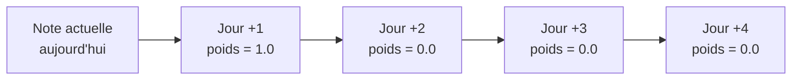
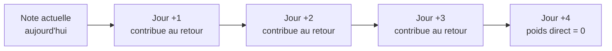

## 1. Contexte 

On veut expliquer la différence entre **TD(0)**, **TD(n)** et **TD(λ)** en utilisant un exemple très concret :

> Évaluer le rendement d’un employé au fil des jours.

Supposons que l’on observe la performance de l’employé sur plusieurs jours futurs :
Jour +1, Jour +2, Jour +3, Jour +4.

L’idée est de comprendre :

* Comment chaque méthode utilise ces jours futurs pour mettre à jour la **note actuelle**.
* Comment ces méthodes diffèrent dans la manière de pondérer les informations futures.

---

## 2. TD(0) : ne regarder que le lendemain

Avec **TD(0)**, la mise à jour se fait uniquement en fonction de ce qui se passe au **prochain pas de temps**.

Dans l’analogie :

> Pour ajuster la note d’aujourd’hui, on ne regarde que la performance de l’employé demain (Jour +1).
> Les jours suivants ne comptent pas directement dans la mise à jour.

Schéma Mermaid correspondant :



Interprétation pédagogique :

* La note actuelle est corrigée uniquement à partir de la performance du jour suivant.
* Une très bonne ou très mauvaise journée demain aura un effet très fort.
* Les jours plus lointains (J+2, J+3, J+4) ne sont pas utilisés directement pour corriger la note.
* C’est une méthode très réactive, mais instable si les performances varient beaucoup d’un jour à l’autre.

---

## 3. TD(n) : regarder un horizon fixe

Avec **TD(n)**, on choisit un entier n et on utilise les n prochaines récompenses pour la mise à jour.
Prenons par exemple **TD(3)**.

Dans l’analogie :

> Pour ajuster la note d’aujourd’hui, on regardera la performance de l’employé sur les trois prochains jours (Jour +1, Jour +2, Jour +3) avant de corriger la note.

Schéma Mermaid possible :



Commentaires :

* La mise à jour de la note d’aujourd’hui est basée sur un retour qui agrège les performances de J+1, J+2 et J+3.
* On peut voir cela comme : “je ne juge l’employé qu’après avoir observé un bloc de 3 jours consécutifs”.
* J+4 ne sert pas directement dans la mise à jour de l’état d’aujourd’hui (il servira pour une autre mise à jour plus tard).
* TD(n) est plus riche que TD(0), mais impose un choix rigide de l’horizon n.
  Si n est trop petit, on reste myope. Si n est trop grand, on réagit trop lentement.

---

## 4. TD(λ) : combiner plusieurs horizons avec des poids décroissants

Avec **TD(λ)**, on ne choisit pas un seul n, mais on combine plusieurs horizons (1 pas, 2 pas, 3 pas, etc.) avec des poids qui décroissent selon un paramètre λ, entre 0 et 1.

Dans l’analogie de l’employé :

> Pour ajuster la note d’aujourd’hui, on tient compte de la performance de l’employé demain, dans deux jours, dans trois jours, dans quatre jours, etc., mais avec une importance décroissante au fur et à mesure que l’on s’éloigne dans le temps.

### Exemple 1 : λ = 0.3 (très court terme)

On donne beaucoup de poids au Jour +1, puis moins aux jours suivants.

Schéma Mermaid :

```mermaid
flowchart LR
    A[Note actuelle<br/>aujourd'hui<br/>TD(λ = 0.3)] --> J1[Jour +1<br/>poids élevé]
    J1 --> J2[Jour +2<br/>poids moyen]
    J2 --> J3[Jour +3<br/>poids faible]
    J3 --> J4[Jour +4<br/>poids très faible]
```

Interprétation :

* Jour +1 a la plus grande influence sur la mise à jour.
* Jour +2 corrige légèrement la note.
* Jour +3 et Jour +4 ont un effet de plus en plus réduit.
* Le comportement est proche de TD(0) mais pas aussi extrême.

### Exemple 2 : λ = 0.7 (prise en compte plus longue)

Cette fois, les jours plus éloignés gardent un poids significatif.

```mermaid
flowchart LR
    A[Note actuelle<br/>aujourd'hui<br/>TD(λ = 0.7)] --> J1[Jour +1<br/>poids important]
    J1 --> J2[Jour +2<br/>poids encore significatif]
    J2 --> J3[Jour +3<br/>poids non négligeable]
    J3 --> J4[Jour +4<br/>poids plus faible mais présent]
```

Interprétation :

* La mise à jour de la note tient compte de la trajectoire sur plusieurs jours.
* Une seule mauvaise journée ne détruit pas l’évaluation si les autres jours restent bons.
* La méthode est plus “juste” vis-à-vis de l’employé, car elle ne sur-réagit pas à une fluctuation isolée.

---

## 5. Comparaison synthétique à partir de l’exemple de l’employé

On peut résumer la philosophie des trois approches comme suit.

### TD(0)

* Principe : ajuster la note d’aujourd’hui en fonction de la performance du **prochain jour uniquement**.
* Avantage : très réactif.
* Inconvénient : évaluation instable, très sensible à la dernière journée.

### TD(n)

* Principe : ajuster la note d’aujourd’hui à partir d’un bloc de **n jours futurs**.
* Avantage : meilleure prise en compte d’une courte trajectoire.
* Inconvénient : nécessite de choisir n à l’avance, ce choix peut être inadapté.

### TD(λ)

* Principe : ajuster la note d’aujourd’hui en combinant **tous les horizons** (1 jour, 2 jours, 3 jours, etc.) avec une importance décroissante contrôlée par λ.
* Avantage : compromis naturel entre réactivité et stabilité, sans fixer un n rigide.
* Paramètre clé :

  * λ proche de 0 → comportement proche de TD(0) (très court terme).
  * λ proche de 1 → comportement proche de Monte Carlo (on tient compte d’une longue histoire).

---

### Formulation finale pour un débutant

À travers le rendement de l’employé :

* TD(0) revient à dire :
  “Je juge surtout sur ce qu’il fait demain.”

* TD(3) revient à dire :
  “Je juge sur ce qu’il fait dans les trois prochains jours, et uniquement sur cela.”

* TD(λ) revient à dire :
  “Je juge en tenant compte de ce qu’il fait demain, dans deux jours, dans trois jours, dans quatre jours, avec une importance qui diminue progressivement, de sorte que les jours les plus proches comptent davantage, mais que les autres ne sont jamais complètement ignorés.”


