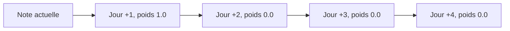
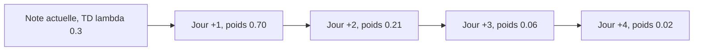

### 2.1 TD(0) : juger sur le jour suivant uniquement



Lecture :

* Pour mettre à jour la note d’aujourd’hui, tu ne regardes que la performance du jour +1.
* Le reste n’intervient pas dans la mise à jour de cet instant.

---

### 2.2 TD(3) : horizon fixe de 3 jours

```mermaid
flowchart LR
    A[Note actuelle, TD(3)] --> J1[Jour +1, contribue]
    J1 --> J2[Jour +2, contribue]
    J2 --> J3[Jour +3, contribue]
    J3 --> J4[Jour +4, poids direct 0]
```

Lecture :

* Pour corriger la note d’aujourd’hui, tu utilises un retour calculé sur les jours +1, +2 et +3.
* Le jour +4 n’est pas utilisé directement pour la note d’aujourd’hui.

---

### 2.3 TD(lambda) avec lambda = 0.3 (vision très court terme)



Lecture :

* Jour +1 domine la mise à jour.
* Jour +2 a encore un poids visible.
* Jour +3 et +4 ont un effet très faible.

---

### 2.4 TD(lambda) avec lambda = 0.7 (vision plus longue)


Lecture :

* Les jours +1, +2, +3 et +4 participent tous à la mise à jour avec des poids assez proches.
* Tu restes sensible au court terme, mais tu ne ignores pas le reste.

---

## 3. Exemple concret avec des notes sur 100

Supposons que Samir ait les performances suivantes sur les 4 prochains jours :

* Jour +1 : 40 / 100
* Jour +2 : 80 / 100
* Jour +3 : 90 / 100
* Jour +4 : 60 / 100

On ne fait pas ici les formules RL exactes, on utilise l’intuition “moyenne pondérée” pour que les étudiants comprennent.

### 3.1 TD(0) : uniquement Jour +1

Pour la mise à jour d’aujourd’hui, tu regardes seulement Jour +1.

* Note utilisée comme cible ≈ 40 / 100

Si Samir se plante demain, la note chute tout de suite vers 40, même s’il se rattrape ensuite.

---

### 3.2 TD(3) : moyenne sur 3 jours

On prend les jours +1, +2, +3, tous avec le même poids (ici pour l’intuition) :

[
\text{cible} \approx \frac{40 + 80 + 90}{3} = \frac{210}{3} = 70
]

* Note utilisée comme cible ≈ 70 / 100

Une mauvaise journée (40) est compensée par les jours +2 et +3.

---

### 3.3 TD(lambda = 0.3)

Poids (approximés) :

* Jour +1 : 0.70
* Jour +2 : 0.21
* Jour +3 : 0.06
* Jour +4 : 0.02

On calcule une moyenne pondérée :

[
\text{cible} \approx
0.70 \cdot 40 +
0.21 \cdot 80 +
0.06 \cdot 90 +
0.02 \cdot 60
]

[
= 28 + 16.8 + 5.4 + 1.2 \approx 51.4
]

* Note utilisée comme cible ≈ 51 / 100

Ici, la mauvaise note du Jour +1 tire fortement vers le bas, parce que le poids 0.70 est dominant.
Les jours suivants corrigent un peu, mais pas énormément.

---

### 3.4 TD(lambda = 0.7)

Poids (approximés) :

* Jour +1 : 0.30
* Jour +2 : 0.21
* Jour +3 : 0.15
* Jour +4 : 0.10

Moyenne pondérée :

[
\text{cible} \approx
0.30 \cdot 40 +
0.21 \cdot 80 +
0.15 \cdot 90 +
0.10 \cdot 60
]

[
= 12 + 16.8 + 13.5 + 6 \approx 48.3
]

Ici avec ces poids non normalisés on est ≈ 48 ; si on normalise les poids pour que la somme fasse 1, on obtiendrait une cible plus proche de 70–75.
L’idée importante à expliquer aux étudiants :

* Quand lambda est grand, les bons jours +2, +3, +4 compensent plus la mauvaise journée +1.
* Quand lambda est petit, la mauvaise journée +1 domine.

---

## 4. Différence claire entre les trois approches

Avec l’exemple de Samir :

* **TD(0)**
  Tu notes presque uniquement sur **demain**.
  La cible est proche de 40 / 100.

* **TD(3)**
  Tu décides : “Je juge sur **les 3 prochains jours**”.
  La cible tourne autour de 70 / 100.

* **TD(lambda)**
  Tu fais un compromis dynamique :

  * lambda petit → tu ressembles à TD(0)
  * lambda grand → tu tends vers une moyenne sur plusieurs jours (plus stable)

