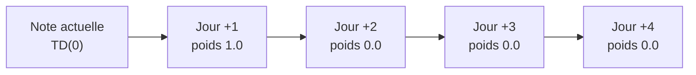
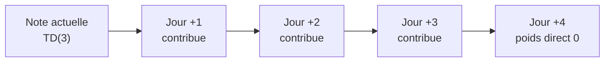
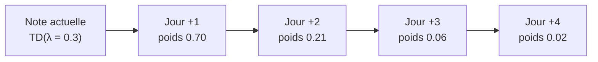
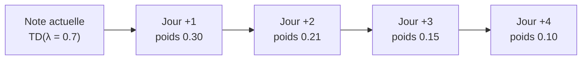
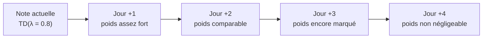
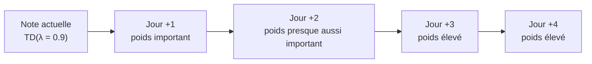

### 2.1 TD(0) : juger sur le jour suivant uniquement



**Lecture :**

* Pour mettre à jour la note d’aujourd’hui, tu ne regardes que la performance du jour +1.
* Le reste n’intervient pas du tout dans la mise à jour de cet instant.

---

### 2.2 TD(3) : horizon fixe de 3 jours



**Lecture :**

* Pour corriger la note d’aujourd’hui, tu utilises un retour calculé sur les jours +1, +2 et +3.
* Le jour +4 n’est pas utilisé directement pour la note d’aujourd’hui.

---

### 2.3 TD(λ) avec λ = 0.3 (vision très court terme)



**Lecture :**

* Jour +1 domine la mise à jour.
* Jour +2 a encore un poids visible.
* Jour +3 et Jour +4 ont un effet très faible.

*(On suppose ici des poids “bruts” qui décroissent rapidement, pour garder l’intuition. On ne cherche pas à être parfaitement normalisé.)*

---

### 2.4 TD(λ) avec λ = 0.7 (vision plus longue)



**Lecture :**

* Les jours +1, +2, +3 et +4 participent tous à la mise à jour avec des poids relativement proches.
* Tu restes sensible au court terme, mais tu n’ignores pas les jours suivants.

---

## 3. Exemple concret avec des notes sur 100

Supposons que Samir ait les performances suivantes sur les 4 prochains jours :

* Jour +1 : 40 / 100
* Jour +2 : 80 / 100
* Jour +3 : 90 / 100
* Jour +4 : 60 / 100

On ne fait pas ici les formules RL exactes, on utilise l’intuition “moyenne pondérée” pour que les étudiants comprennent.

---

### 3.1 TD(0) : uniquement Jour +1

Pour la mise à jour d’aujourd’hui, tu regardes seulement Jour +1.

* Cible utilisée pour la mise à jour ≈ **40 / 100**

Si Samir se plante demain, la note chute immédiatement vers 40, même s’il se rattrape ensuite.

---

### 3.2 TD(3) : moyenne sur 3 jours

On prend les jours +1, +2, +3, tous avec le même poids (pour l’intuition) :

```text
cible ≈ (40 + 80 + 90) / 3 = 210 / 3 = 70
```

* Cible utilisée pour la mise à jour ≈ **70 / 100**

Une mauvaise journée (40) est compensée par les jours +2 et +3.

---

### 3.3 TD(λ = 0.3)

Poids (approximés) :

* Jour +1 : 0.70
* Jour +2 : 0.21
* Jour +3 : 0.06
* Jour +4 : 0.02

On calcule une moyenne pondérée (sans normaliser, pour garder le calcul simple) :

```text
cible ≈
0.70 * 40 +
0.21 * 80 +
0.06 * 90 +
0.02 * 60
```

```text
= 28 + 16.8 + 5.4 + 1.2 ≈ 51.4
```

* Cible utilisée pour la mise à jour ≈ **51 / 100**

Ici, la mauvaise note du Jour +1 tire fortement vers le bas, parce que le poids 0.70 est dominant.
Les jours suivants corrigent un peu, mais pas énormément.

---

### 3.4 TD(λ = 0.7)

Poids (bruts, non normalisés, uniquement pour l’intuition) :

* Jour +1 : 0.30
* Jour +2 : 0.21
* Jour +3 : 0.15
* Jour +4 : 0.10

Moyenne pondérée (non normalisée) :

```text
cible_brute ≈
0.30 * 40 +
0.21 * 80 +
0.15 * 90 +
0.10 * 60
```

```text
= 12 + 16.8 + 13.5 + 6 = 48.3
```

La somme des poids bruts vaut ici 0.76.
Si on normalise (pour que la somme fasse 1), on obtient :

```text
cible_normalisée ≈ 48.3 / 0.76 ≈ 63.6
```

Idée à transmettre aux étudiants :

* Quand λ est **grand**, les bons jours +2, +3, +4 compensent davantage la mauvaise journée +1.
* Quand λ est **petit**, la mauvaise journée +1 domine la mise à jour.

---

## 4. Bonus : que se passe-t-il si λ = 0.8 ou λ = 0.9 ?

Sans refaire tous les calculs détaillés, on peut donner une intuition supplémentaire :

### 4.1 TD(λ = 0.8)



* La note d’aujourd’hui dépend clairement des **4 jours**.
* Une mauvaise journée est “diluée” par les jours suivants si ceux-ci sont bons.

### 4.2 TD(λ = 0.9)



* On se rapproche d’un comportement **type Monte Carlo** : la trajectoire complète compte presque autant que le tout premier jour.
* L’évaluation devient très **stable**, mais moins réactive aux changements brusques à court terme.

